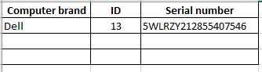

# Android-OCR-for-computer-inventory
Problem statement: Using Android camera take an image and do an OCR to extract the serial number, id and computer brand of computers
in Excellerent Technology Solutions Ethiopia delivery center.

The images to capture look like the image below.

What we need is to register the information displayed on the images into an excelsheet as follow

## Tools
Android studio
For the Android user interface development

Tesseract
Tesseract is an optical character recognition engine for various operating systems. 
It is free software, released under the Apache License, Version 2+++.0. And Tesseract Tools for Android 
is a set of Android APIs and build files for the Tesseract OCR and Leptonica image processing libraries.
We extract characters one by one from the captured data with Tesseract.

Python
For the preprocessing

